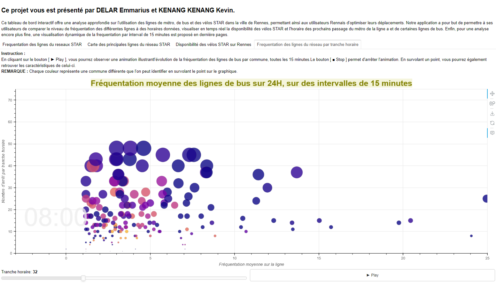

# Dashboard sur le transport rennais avec BOKEH
---

Features
========
Ce tableau de bord interactif offre une analyse approfondie de l'utilisation des lignes de métro, de bus et des vélos STAR dans la ville de Rennes, permettant ainsi aux utilisateurs Rennais d'optimiser leurs déplacements. Notre application a pour but de permettre à ses utilisateurs de comparer le niveau de fréquentation des différentes lignes à des horaires donnés, visualiser en temps réel la disponibilité des vélos STAR et l'horaire des prochains passages du métro de la ligne A et de certaines lignes de bus. Enfin, pour une analyse encore plus fine, une visualisation dynamique de la fréquentation par intervalles de 15 minutes est proposée en dernière page.




## Guide rapide
---

1. Avant d'exécuter le script, assurez-vous d'avoir installé la bonne version de chaque bibliothèque (en particulier Bokeh) en utilisant la commande suivante : 
```shell
pip install -r requirements.txt
```

2. Le dashboard est disponible en version statique avec une sortie HTML et en version dynamique avec la création d'un serveur localhost temporaire (cela affecte uniquement la visualisation du graphique en dernière page). Chacune des sorties s'obtient avec une commande spécifique à exécuter dans un terminal ouvert à l'emplacement du dossier : 
    * Pour la sortie html : lancer la commande
    ```shell
    python Transport_Rennais.py
    ```
    * Pour le serveur localhost : lancer la commande
    ```shell
    bokeh serve --show Transport_Rennais.py 
    ```


## Architecture du projet
---

Le projet est organisé en 5 scripts par soucis de clarté du code : 
    1. graphique_frequentation.py : Correspond aux graphiques de la 1er page "Frequentation des lignes du réseaux STAR" 
    2. carte_metro_bus.py : Correspond a la carte de la 2nd page "Carte des principales lignes du réseau STAR" 
    3. velos.py : Correspond au graphique de la 3e page "Disponibilité des velos STAR sur Rennes" 
    4. gapminder_chiffre_frequentation.py : Correspond au graphiques dynamique de la 4ème page "Frequentation des lignes du réseau par tranche horaire" 
    5. Transport_Rennais.py : Correspond au script qui formate la page Bokeh en regroupant l'ensemble des autres scripts.

> **Note** : L'application n'est pas optimisée pour la gestion des sessions utilisateurs, il est donc nécessaire de réexécuter le script dès lors que la connexion initiale est perdue (ex : rafraichissement de la page, fermeture, connexion simultanée, ...).
